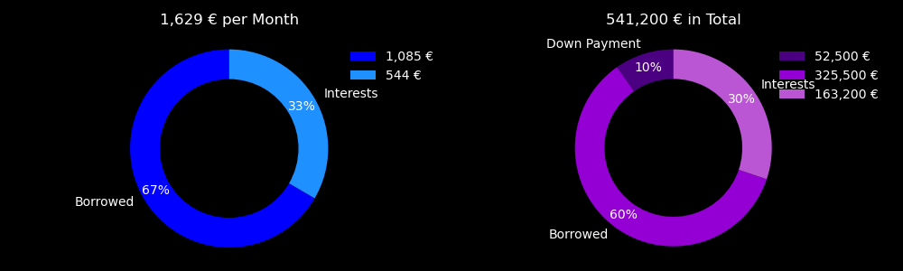

# Bank Loan Simulator

This Python project is a **bank loan simulator** specifically designed for calculating the costs associated with purchasing a property in France. It provides a detailed breakdown of monthly payments, total costs, and interest, and includes a visual representation of the financial plan.

---

## Features

- **Monthly Payment Calculation**: Determine the monthly payment (mensuality) based on the loan amount, interest rate, and loan duration.
- **Cost Breakdown**:
  - Down payment
  - Notary fees
  - Monthly interest vs. borrowed amount
  - Total payment and interest over the loan duration.
- **Visualization**: Generates pie charts illustrating:
  - Monthly cost distribution (borrowed vs. interest).
  - Total cost distribution (down payment, borrowed, interest).
- **Dark Theme Support**: Option to enable/disable a dark theme for the visualizations.

---

## How to Use

1. Clone the repository:
   ```bash
   git clone <repository_url>
   cd <repository_directory>
   ```

2. Install the required libraries:
   ```bash
   pip install matplotlib
   ```

3. Run the script:
   ```bash
   python main.py
   ```

4. Enter the required inputs when prompted:
   - Property cost (in €).
   - Downpayment rate (in %).
   - Notary fees rate (in %).
   - Annual interest rate (in %).
   - Loan duration (in years).

5. View the results directly in the terminal and as a saved image (`RealEstate.png`) in the project directory.

---

## Example Output

The program outputs a detailed breakdown of the financial plan, including:

- **Monthly payment**
- **Total payment**
- **Interest paid**
- **Suggested minimum annual salary**

### Visualization

Below is an example image of the generated pie charts:



---

## File Structure

- `main.py`: Main script containing the loan calculation and visualization logic.
- `RealEstate.png`: Example output image (generated after running the script).

---

## License
This project is licensed under the MIT License.

## Author
© 2025 [Anthony Aoun](https://github.com/Anthony-Aoun). All rights reserved.

This project is open-source and free to use for educational purpouses only.
